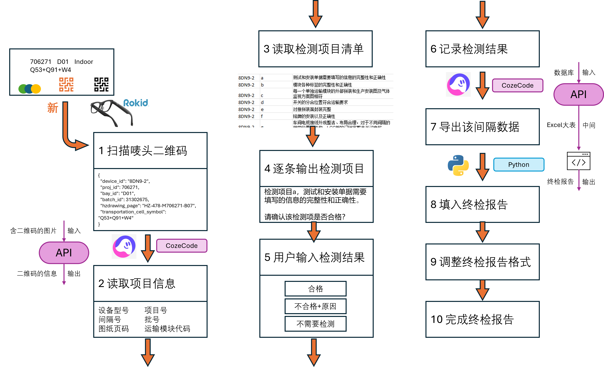

# Rokid AI眼镜辅助生成终检报告
这个仓库提供了实现AI眼镜生成终检报告所用到的所有开发文件和介绍

## 目标
通过AI眼镜的摄像头，语音输入和智能体功能，通过对话完成对设备的检测以及结果录入，最终生成检测报告

## 实现方式


## 仓库结构
|文件夹名称|简介|
|--|--|
|[rizon-agent](rizon-agent)|在【灵珠】和【扣子编程】平台上开发眼镜的工作流的具体实现方式|
|[fcr-generator](fcr-generator)|自动化终检报告形成的python脚本|
|[resources](resources)|过程中用到的[案例二维码](resources/qrcodes_706271)，[demo视频](resources/demo_videos)和[汇报PPT](resources/presentation)

## 使用方法
1. 将本仓库克隆到本地
```bash
git clone https://github.com/YiminHu26/fcr_ai_glasses.git
```
1. 阅读各文件夹内的README说明上手操作