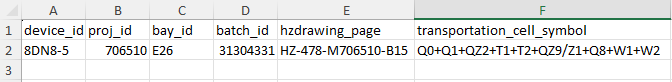

# 生成二维码脚本
这是用于生成内容为JSON格式字符串的二维码的python脚本

## 设置
1. 阅读[教程](https://docs.astral.sh/uv/getting-started/installation/),下载uv,这里我用winget方法
```bash
winget install --id=astral-sh.uv  -e
```

## 使用
1. 将所需要生成设备的```设备型号device_id```，```项目号proj_id```，```间隔号bay_id```，```批号batch_id```，```运输单元代码transportation_cell_symbol```写进[```assets/data.xlsx```](assets/data.xlsx)这张表格，例如下图（可以写多台设备）

2. 运行以下代码
```bash
uv run qr-generator
```
3. 生成的二维码将会被保存在[```assets/qrcodes```](assets/qrcodes)目录下
