# Git使用技巧(git/github/gitee)

## 基础设置

### 安装git

```powershell
winget install --id Git.Git -e --source winget
```

### 注册

#### Github

- 打开[Github](https://github.com/), 右上角 - Sign Up

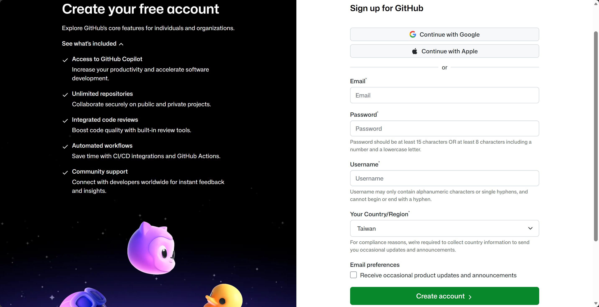

- 设置邮箱, 密码和用户名 (一般就是英文和数字组合, 比如名字拼音, 不要加下划线等其他符号)

#### Gitee

- 打开[Gitee](https://gitee.com/), 右上角-注册


- 设置姓名/用户名和个人空间地址 (一般就是英文和数字组合, 比如名字拼音, 不要加下划线等其他符号)

- 设置密码和手机号验证

### 设置双因素认证(2FA)

- 设置-基本设置-双因素认证(2FA)

需要用户使用Authenticator APP (比如Microsoft Authenticator)来进一步提升账户的安全性, 也是后续克隆仓库的前提条件

### 设置邮箱

- 设置-基本设置-邮箱管理

这里需要设置主邮箱, 建议github和gitee都用同一个邮箱, 这个邮箱后面还会用到

### SSH公钥设置

- 配置用户名和邮箱

```powershell
git config --global [user.name](http://user.name/) "你的Git用户名"
git config --global user.email "你的GitHub/Gitee注册邮箱"
```

这一步还挺重要的, 虽然不设置也可以提交仓库, 但是会出现身份识别不出, 不统计贡献度等问题

原则上用户名可能在github和gitee不一样/有大小写差异, 但只要邮箱一致就可以识别出身份

### 生成SSH公私钥 (以ed25519为例)

```powershell
# 退回系统根目录
cd
# 进入储存密钥的目录, 如果显示没有这个目录则说明之前还没有生成过密钥
cd .ssh
# 生成密钥的命令行
ssh-keygen -t ed25519 -C "这里可以写一些备注, 一般就写Github/Gitee注册邮箱"
```

后面会需要选定密钥的储存位置和密码(输入2次), 这里可以全部回车跳过

这里会回复例如如下的输出:

```powershell
Generating public/private ed25519 key pair.
Enter file in which to save the key (C:\Users\Username\.ssh/id_ed25519):
Enter passphrase (empty for no passphrase):
Enter same passphrase again:
Your identification has been saved in C:\Users\Username\.ssh/id_ed25519
Your public key has been saved in C:\Users\Username\.ssh/id_ed25519.pub
The key fingerprint is:
SHA256:ohDd0OK5WG2dx4gST/j35HjvlJlGHvihyY+Msl6IC8I Gitee SSH Key
The key's randomart image is:
+--[ED25519 256]--+
|    .o           |
|   .+oo          |
|  ...O.o +       |
|   .= * = +.     |
|  .o +..S*. +    |
|. ...o o..+* *   |
|.E. o . ..+.O    |
| . . ... o =.    |
|    ..oo. o.o    |
+----[SHA256]-----+
```

- 进入.ssh目录查看公私钥

```powershell
cd .ssh
ls
```

- 会看到一对名字为id_ed25519的文件, 如:

```powershell
    Directory: C:\Users\Username\.ssh

Mode                 LastWriteTime         Length Name
----                 -------------         ------ ----
-a----         7/26/2026  11:16 PM            419 id_ed25519
-a----         7/26/2026  11:16 PM            107 id_ed25519.pub
```

这里id_ed25519是”私钥”, 而id_ed25519.pub是”公钥”

私钥需要保存在自己的电脑上, 而公钥需要上传到Github/Gitee上

- 读取公钥文件

```powershell
cat .\id_ed25519.pub
```

cat是在命令行里直接查看文件内容的指令

- 得到如下回复:

```powershell
ssh-ed25519 AAAA***5B xx@xx(这里是之前填写的备注)
```

- 将该公钥复制出来

### 设置账户SSH公钥

#### Github

- Setting - Access - SSH and GPG keys - SSH keys - New SSH key

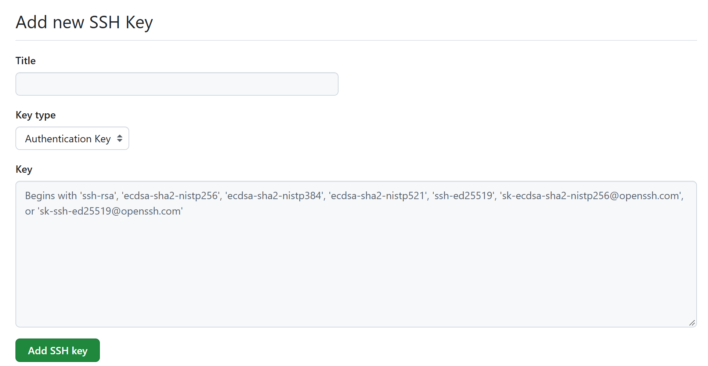

- “Title”可以随便取一个能够让你识别出这是哪台设备上的公钥的名字

- “Key type”保持”Authentication Key”

- “Key”即把之前在ed_25519.pub上复制的内容粘贴过来, 后续会需要验证用户名和密码完成设置

#### Gitee

- 设置-安全设置-SSH公钥

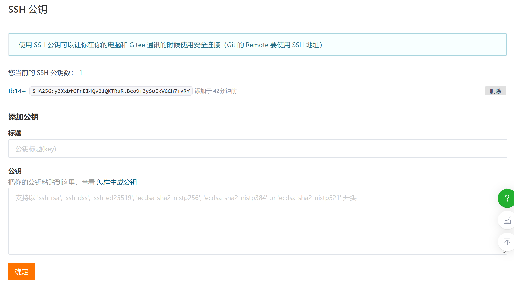

- “标题”可以随便取一个能够让你识别出这是哪台设备上的公钥的名字

- “公钥”即把之前在ed_25519.pub上复制的内容粘贴过来, 后续会需要验证用户名和密码完成设置

### 验证SSH公钥绑定是否完成

- 在命令行中输入对应平台的代码

```powershell
# Github
ssh -T git@github.com
# Gitee
ssh -T git@gitee.com
```

- 得到如下回复表示认证完成

```
# Github
Hi Username! You've successfully authenticated, but GitHub does not provide shell access.
# Gitee
Hi Username! You've successfully authenticated, but GITEE.COM does not provide shell access.

```

## Git常用指令

### 自己新建一个本地仓库后上传至Github/Gitee远程仓库

这里以一个名为ros2_tutorial的仓库为例

1. 在目录下进行git初始化

```powershell
mkdir ros2_tutorial
cd ros2_tutorial
# 通过git把这个目录变为可管理的仓库
git init
```

2. 在Github/Gitee上创建可以提交的远程仓库

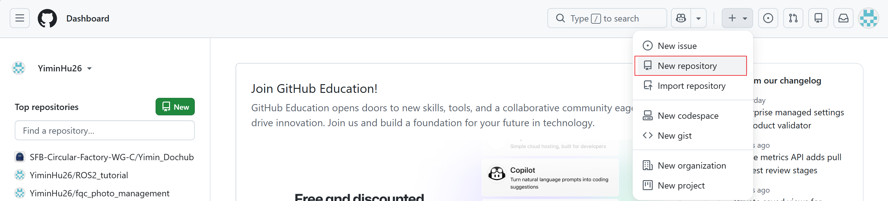

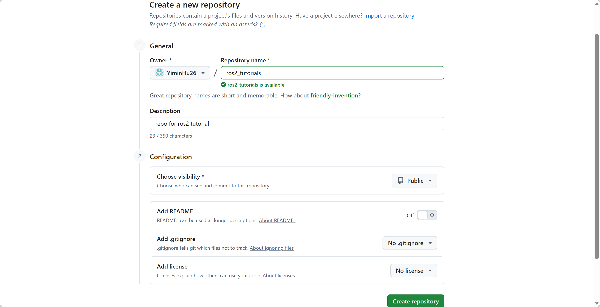

写上仓库名和说明, 由于这个仓库的初始化在本地完成, 因此README和.gitignore暂时可以都不需要, license也可以不选择, 这表示禁止他人合法使用, 具体可以参考[GitHub 开源许可证（Licenses）完全指南 • 小伞的博客](https://xiaosan-dev.github.io/post/blog/github-licenses/)

3. 然后在本地将这个远程仓库加上

```powershell
# 先把当前本地文档里的文档上传到本地仓库
git add .
#       ↑ 注意有个".", 表示该目录下的所有内容
# 然后写一个提交到远程仓库时的备注, 记得用"-m"
git commit -m "first commit"
# 这里强制重命名目前分支的名称为main,主要是为了命名规范
git branch -M main
# 加上远程仓库的git链接,将这个远程仓库称作"origin"
git remote add origin git@github.com:YiminHu26/ros_tutorial.git
# 将当前本地仓库的文件推送到远程仓库origin的main分支
git push -u origin main
#         ↑这里只有第一次提交的时候需要写"-u",后续就不需要了
```

4. 去Github上查看提交是否成功

### 从一个其他人创建的远程仓库下载代码, 修改并提交

这里以Github上YiminHu26/ros2_tutorial的仓库为例

1. 先把这个仓库fork到自己的帐号里

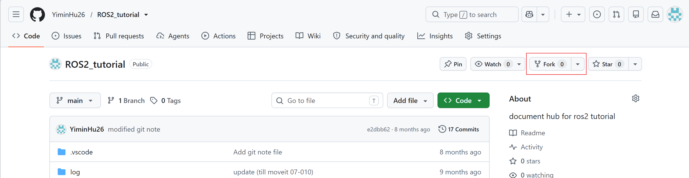

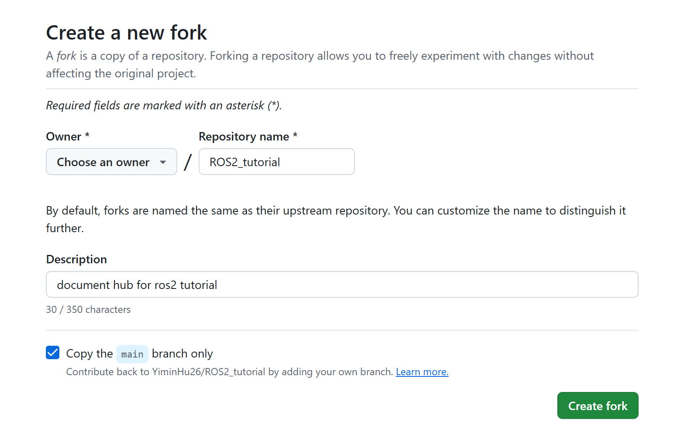

2. 在本地找一个存放代码的目录, 克隆这个fork后的仓库

```powershell
git clone git@github.com:Username/ros2_tutorial.git
```

3. 进行后续开发

## 开发规范

- 一般不在main分支上直接改动, 要先创建一个新的分支(命名可以是dev_<要改动的功能>), 完成新功能后提交pull request (PR), 然后仓库拥有者进行分支合并

- 分支合并后应当删除远程仓库里的dev分支, 本地的dev分支也需要被删除

- 后续再开发新功能重复该流程

### 例子
从Gitee上fork yiminhu26/fcr_ai_glasses仓库,完成改动后提交PR给原仓库
1. 从Gitee上fork原仓库,这里命名为fcr_ai_glasses_**1**
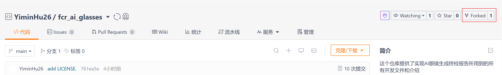
2. 克隆到本地
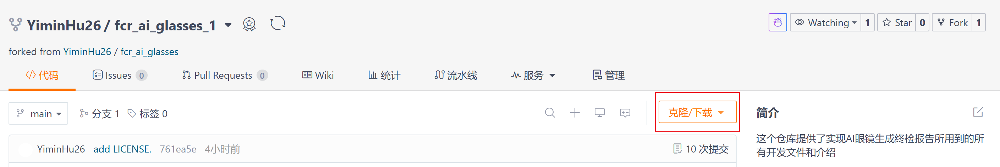
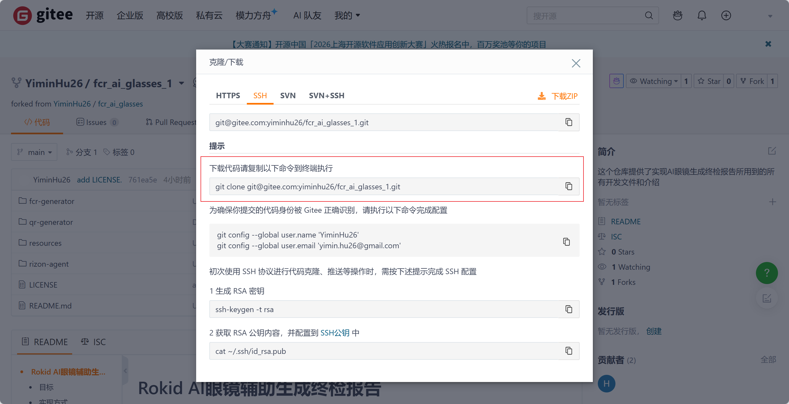

```powershell
git clone git@gitee.com:yiminhu26/fcr_ai_glasses_1.git
```

收到的回复如下:
```
Cloning into 'fcr_ai_glasses_1'...
remote: Enumerating objects: 179, done.
remote: Counting objects: 100% (179/179), done.
remote: Compressing objects: 100% (153/153), done.
remote: Total 179 (delta 21), reused 179 (delta 21), pack-reused 0 (from 0)
Receiving objects: 100% (179/179), 57.92 MiB | 4.83 MiB/s, done.
Resolving deltas: 100% (21/21), done.
```

3. 新建一个新的分支dev_new_note
```powershell
git switch -c dev_new_note
```
可以通过```git branch```命令查看目前的分支
得到的回复如下:
```
* dev_new_note
  main
```
这里*表示目前所在分支

4. 把原仓库添加到upstream分支
```powershell
git remote add upstream git@gitee.com:yiminhu26/fcr_ai_glasses.git
#                                                             ↑这里没有"_1", 是原仓库
```
5. 完成改动后提交到本地仓库
```powershell
# 建议先fetch和merge一下原仓库的原分支
# fetch拉取远程更新(不自动合并)
git fetch upstream main
# 选择要合并的本地分支(即远程的upstream/main要合并到我本地的dev_new_note分支上)
git checkout dev_new_note
# 合并改变
git merge upstream/main
# 然后再把本地的改变提交到本地仓库
git add .
git commit -m "Updated note for git"
```

收到的回复如下:
```
[dev_new_note 5bf0334] Updated note for git
 12 files changed, 299 insertions(+)
 create mode 100644 resources/git_note/README.md
 create mode 100644 resources/git_note/gitee_fork_1.png
 ...
```

4. 提交到远程仓库
```powershell
git push origin dev_new_note
```
注意这里的```dev_new_note```指的是要提交的分支,如果错写成```main```则不会有内容被提交,因为```main```分支没有新的内容

收到的回复如下:
```
Enumerating objects: 18, done.
Counting objects: 100% (18/18), done.
Delta compression using up to 16 threads
Compressing objects: 100% (16/16), done.
Writing objects: 100% (16/16), 2.54 MiB | 7.83 MiB/s, done.
Total 16 (delta 2), reused 0 (delta 0), pack-reused 0 (from 0)
remote: Powered by GITEE.COM [1.1.23]
remote: Set trace flag 4b4649b2
remote: Create a pull request for 'dev_new_note' on Gitee by visiting:
remote: https://gitee.com/yiminhu26/fcr_ai_glasses_1/pull/new/yiminhu26:dev_new_note...yiminhu26:main
To gitee.com:yiminhu26/fcr_ai_glasses_1.git
 * [new branch]      dev_new_note -> dev_new_note
```

5. 提交Pull Request
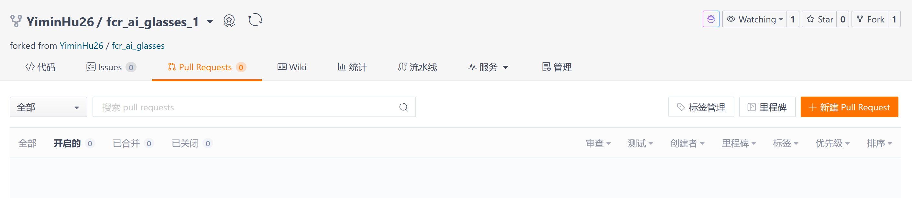
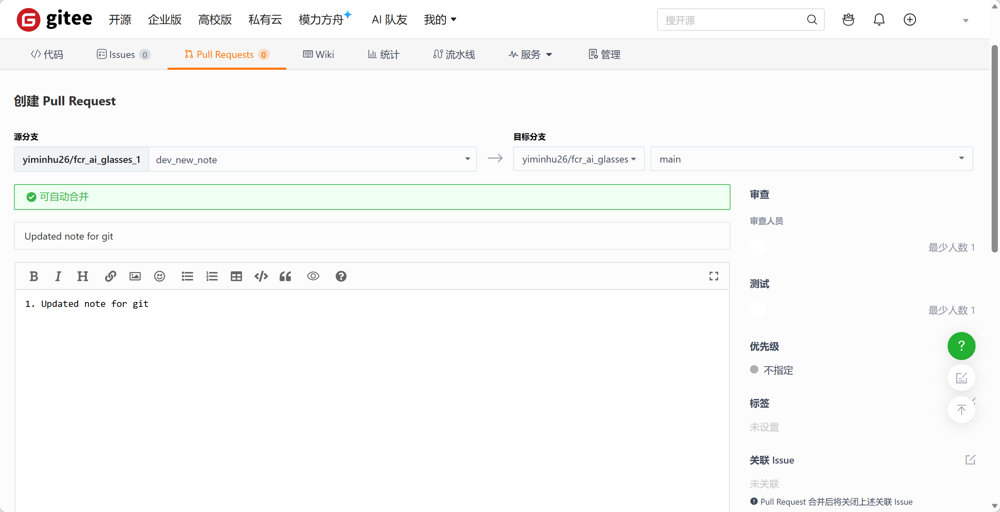
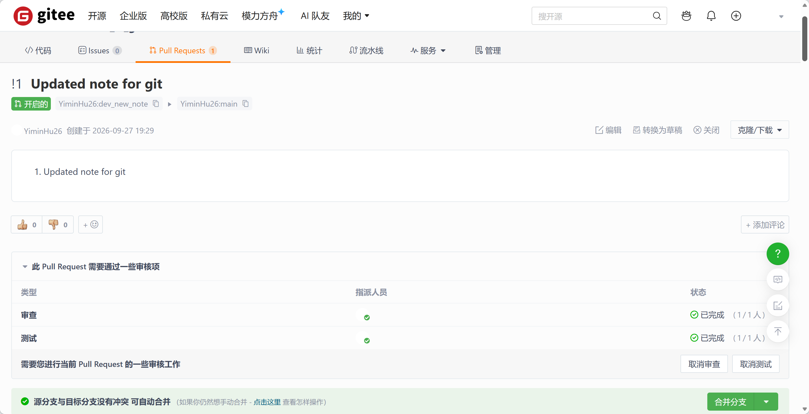
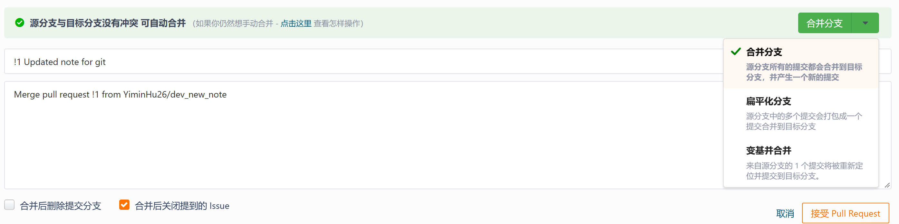