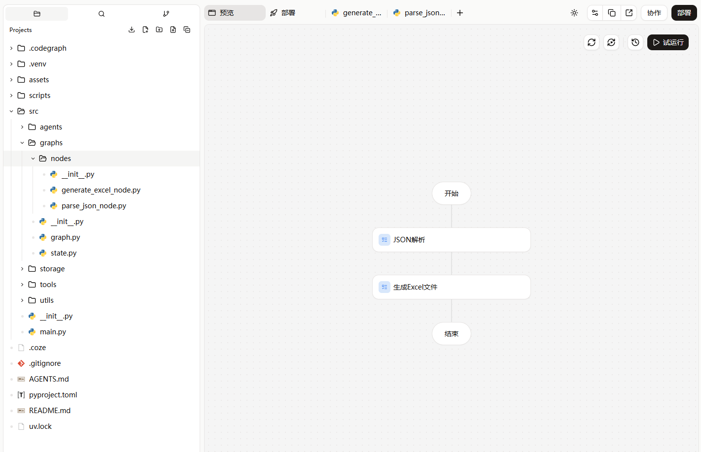
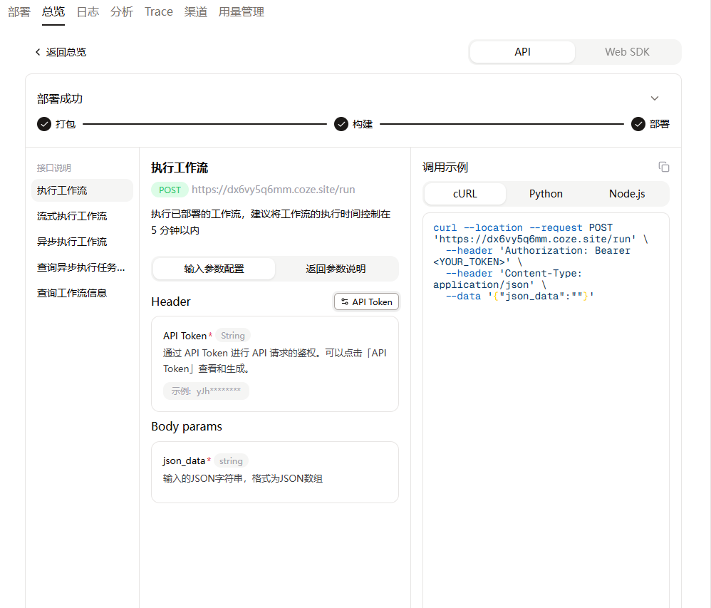
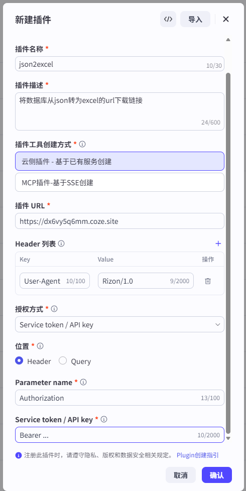
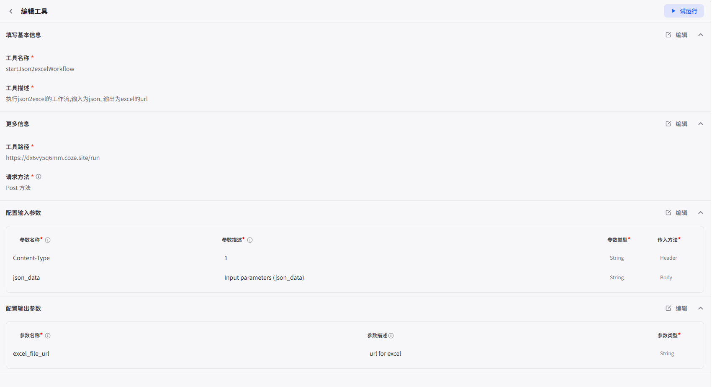
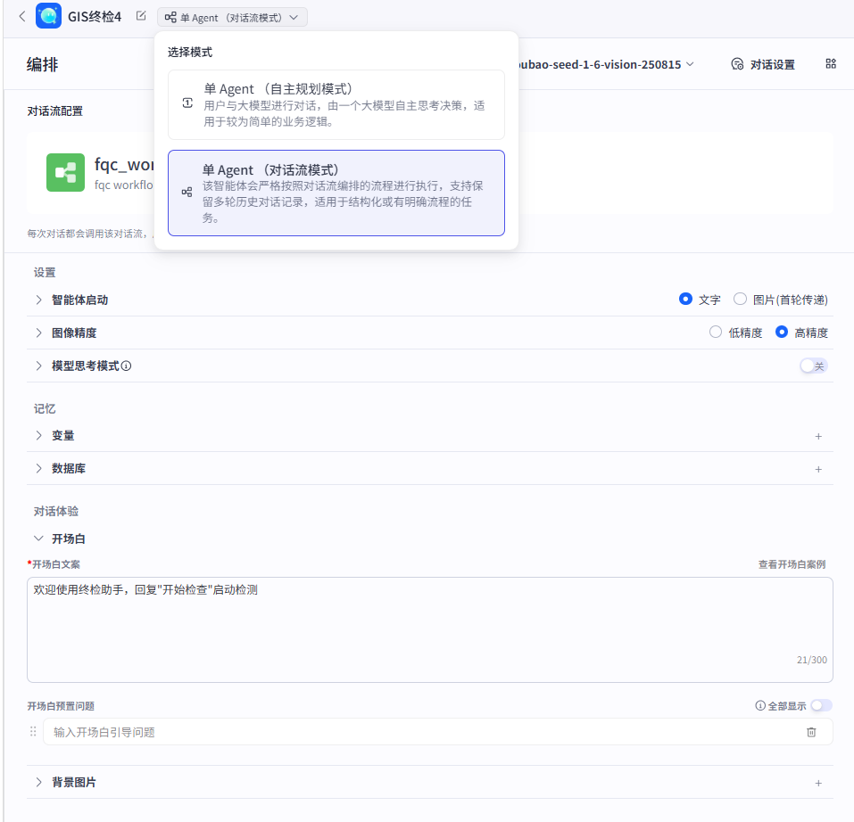

## 使用

### 【灵珠】数据库
- 在【灵珠】-```资源库```-```创建```-```数据库```
- 本项目里用到了三个数据库, [proj_info_list](rizon-database-structure/数据库-proj_info_list.png)用于存储从二维码里得到的设备信息, [fqc_inspecion_items](rizon-database-structure/数据库_fqc_inspection_items.png)用于存储检测项目，[inspection_result_new](rizon-database-structure/数据库_inspection_result_new.png)用于存储检测结果方便后续导出
    - 在建好[fqc_inspecion_items](rizon-database-structure/数据库_fqc_inspection_items.png)后可以导入[inspection_items_list](rizon-agent/rizon-database-structure/inspection_items_list.xlsx)，该表格包括了8DN8-5，8DN9-2，8DQ1-6，8DQ1-3，8VM1设备的15个检测项，可以根据需求删减或者修改
### 【灵珠x扣子】API


- 在【扣子编程】首页选择```工作流```，上传压缩包，并输入```解压这个文件夹作为工作流```

- 完成后应该有完整的项目结构，以下为[json2excel](cozecode-rizon-api-json2excel)项目结构的案例

- 点击```部署```，部署完成后点击```API Token```获取token

- 在【灵珠】-```资源库```-```创建```-```插件```新建插件，可以参考[官方教程](https://rokid.yuque.com/ub8h5n/hth52o/tkcm194uz3ptfhc9)
    - 里面具体的参数可以参考[json2excel](cozecode-rizon-api-json2excel/2-API授权.png)和[qrurl2object](cozecode-rizon-api-qrurl2object/2-API授权.png)，这里以前者为例， ```API key```里填上一步获取的```API token```

- 参照```部署```里的调用示例，配置【灵珠】的工具
    - 主要是要配置```工具路径```,```请求方法```,```输入参数```-```传入方法```

- ```试运行```后```发布```该插件即可在工作流中被调用

### 【灵珠】工作流
- 在【灵珠】-```资源库```-```创建```-```工作流```
- 参考[工作流的元素](rizon-workflow-elements)
- 建议可以一步步建立这个工作流
    - 第一步：工作流1-扫码后输出设备信息
        - 重点：插件，拍照，输入节点关键词判断，JSON字符串转换
    - 第二步：工作流2-根据设备型号从数据库里找到对应检测项目
        - 重点：查询数据库（熟悉查询字段和查询条件）
    - 第三步：工作流3-根据设备型号从数据库里找到对应检测项目，并逐条输出
        - 重点：循环
    - 第四步：工作流4-根据设备型号从数据库里找到对应检测项目，逐条输出，获取用户回复（OK/NOK/Skipped），并将结果存入数据库
        - 重点：循环，提问节点，变量聚合，写入数据库
    - 第五步：工作流5-（不一定要加上前面的循环）将检测结果通过api导出为可下载的url
        - 重点：插件，JSON字符串转换，输出节点
    - 第六步：工作流6-组合扫码和检测的工作流，验证可行性
        - 重点：写入和读取数据库，整体的应用

### 【灵珠】智能体
- 在【灵珠】-```项目开发```-```创建```
- 默认是```单Agent(自主规划模式)```，但实际用下来感觉```单Agent(对话流模式)```比较符合目标的工作流程
    - 因为前者AI总是会脱离设定的工作流回答，而且会提出不存在数据库里的检测内容

- 在网页调试没问题后可以实机调试
    - ```Rokid AI APP```-```连接眼镜```-```设置```-```开发者```-```智能体调试```